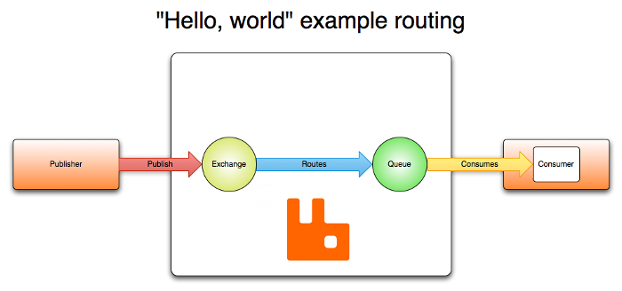

# Asynchronous Messaging with RabbitMQ and Node.js


This project demonstrates how to implement asynchronous messaging using RabbitMQ and Node.js. RabbitMQ is a message broker that allows applications to communicate with each other by sending and receiving messages.


## Table of Contents

- [Introduction](#introduction)
- [Prerequisites](#prerequisites)
- [Installation](#installation)
- [Flow](#flow)


## Introduction

Asynchronous messaging is a powerful technique for decoupling different parts of an application. By using a message broker like RabbitMQ, you can send messages between services without waiting for a response, improving the scalability and reliability of your system.

## Prerequisites

Before you start, make sure you have the following installed:

- [Node.js](https://nodejs.org/) (v14 or higher)
- [RabbitMQ](https://www.rabbitmq.com/download.html)
- [React Js](https://react.dev/)

1. Clone the repository:

   ```bash
   git clone https://github.com/RajanTank/async-messaging-rabbitmq-nodejs.git
   cd async-messaging-rabbitmq-nodejs
   ```


2. Install the dependencies on both the folders:

    ```bash
    npm install
    ```

3. Create `.env` file on the backend folder and add two variable 

    ```
    MONGO_URL=mongodb+srv ..
    RABBIT_URI=amqp://localhost:5672
    ```

4. Start Backend server
   
   ```bash
   npm start
   ```

5. Start Frontend Server
   ```bash
   npm start
   ```


### Flow
 
  

  Different type of exchange

  

  We are using direct exchange on our example for deliver asynchronous message 


